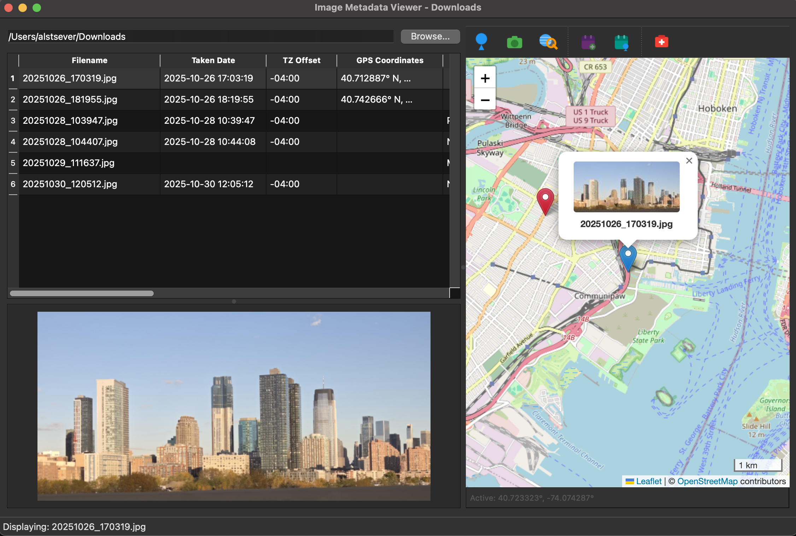
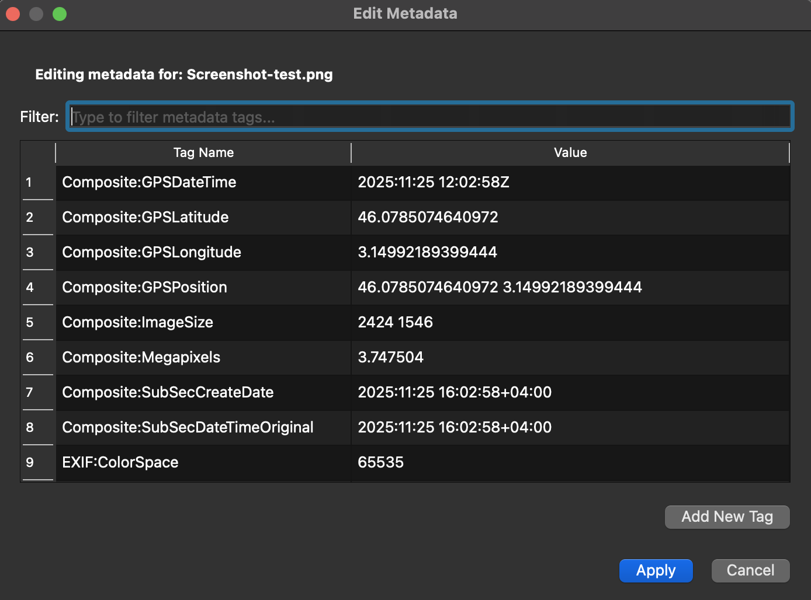
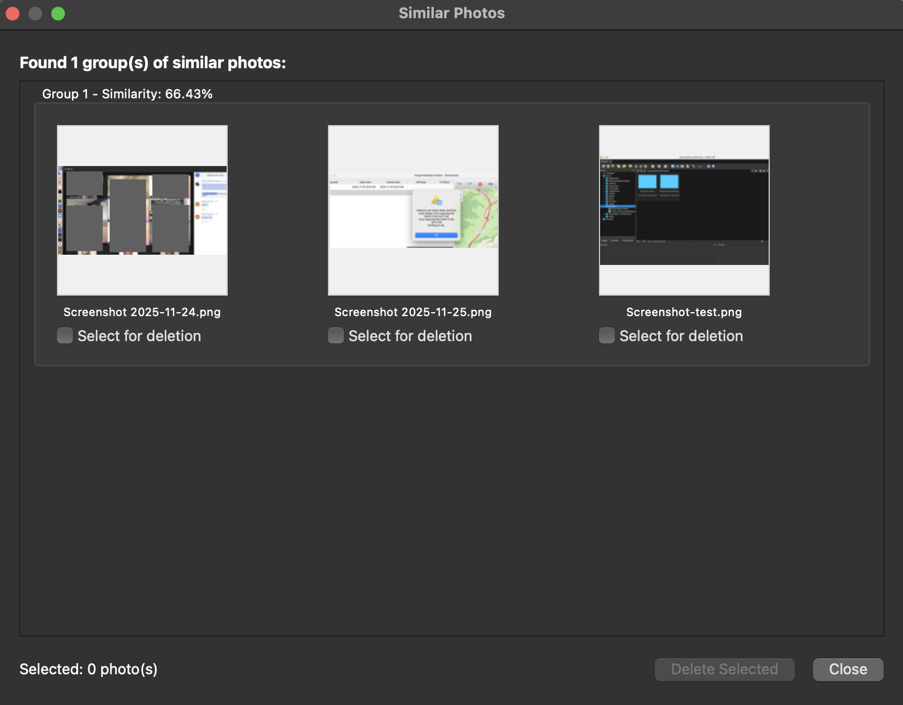
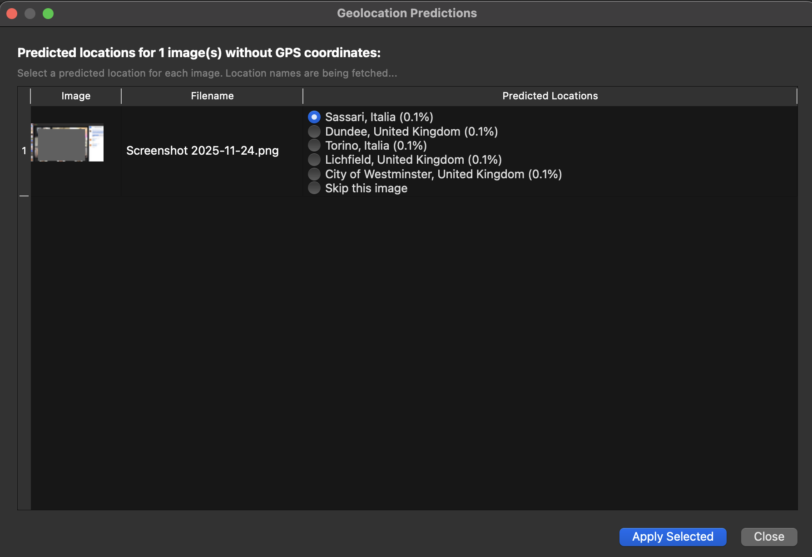
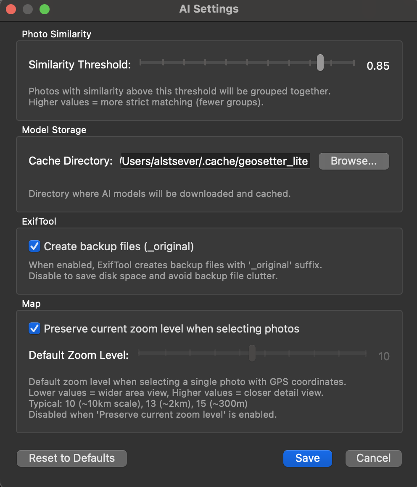

# GeoSetter Lite - Image Metadata Viewer and Editor

A comprehensive Python application for viewing and editing EXIF/IPTC/XMP metadata of images in a directory, with advanced geotagging capabilities and reverse geocoding.

> [!NOTE]
> This application is a tribute to GeoSetter (<https://geosetter.de/en/main-en/>) and is not affiliated with or endorsed by the original GeoSetter project.
>
> This is a light clone, written in Python, focusing on core geotagging features with additional AI-powered functionalities. The triggering reason was the lack of a macOS version of GeoSetter along with the desire to experiment with AI models for photo processing.

## Features

### Core Features
- **Image List View**: Display all JPEG and PNG images from a directory with comprehensive metadata columns
- **Image Viewer**: View selected images in a resizable panel with thumbnail support
- **Interactive Map**: Display all images with GPS coordinates on an OpenStreetMap with visual distinction for selected images
- **Active Marker**: Click anywhere on the map to set an active marker for batch GPS updates
- **GPS Coordinate Management**: Update multiple images with GPS coordinates from the active marker
- **3-Pane Resizable Layout**: Image list (top-left), image viewer (bottom-left), and map with toolbar (right)
- **Metadata Editor**: Edit EXIF/IPTC/XMP metadata for single or multiple images with namespace display
- **Batch Operations**: Apply metadata changes to multiple images at once
- **Inline Editing**: Edit metadata directly in the table with specialized editors for different field types

### Advanced Features
- **Reverse Geocoding**: Automatically determine country and city from GPS coordinates using OpenStreetMap Nominatim API
- **Smart Country Picker**: Searchable dropdown with 195+ countries using 3-letter ISO codes (ISO 3166-1 alpha-3)
- **Timezone Management**: Automatic timezone offset calculation with DST support
- **Date/Time Management**: Comprehensive date handling with Taken Date, Created Date, and GPS Date (UTC)
- **Keywords Auto-Update**: Automatically add country code and country name to keywords
- **Filename Editing**: Rename files directly from the table (including ExifTool backup files)
- **Metadata Repair**: Fix/repair corrupted metadata with ExifTool's repair function
- **File Preservation**: Original file creation dates are preserved; only modification dates are updated
- **Backup Management**: ExifTool creates backup files with `_original` suffix (can be disabled)

### AI-Powered Features
- **Photo Similarity Detection**: Find duplicate or similar photos using ResNet-based deep learning
  - Configurable similarity threshold (0.0-1.0)
  - Groups similar photos with similarity scores
  - Batch deletion of similar photos
  - Runs locally with lightweight models (~45MB)
- **Geolocation Prediction**: Predict GPS coordinates for photos without location data
  - Uses CLIP-based vision-language model (~400MB)
  - SQLite database with 1000+ world locations (cities, landmarks, natural features)
  - Location data loaded from `data/world_locations.csv` (easy to update/extend)
  - Provides top 5 location predictions with confidence scores
  - Automatic reverse geocoding for predicted locations
  - Batch GPS coordinate updates
  - Runs entirely offline after initial model download
  - Database auto-initializes on first run from CSV file
  - To rebuild database: delete `locations.db` and restart app
  - To add locations: edit `world_locations.csv` directly

## Screenshots

### Main Window - Image Metadata Viewer

*3-pane layout with image list, image viewer, and interactive map*

### Metadata Editor

*Edit EXIF/IPTC/XMP metadata with filtering and tag management*

### AI-Powered Photo Similarity Detection

*Find and manage duplicate or similar photos*

### AI-Powered Geolocation Prediction

*Predict GPS coordinates for photos without location data*

### Settings & Preferences

*Configure AI features and model cache*

## Requirements

- Python 3.12.9 or higher
- ExifTool installed on your system

### Installing ExifTool

**macOS:**
```bash
brew install exiftool
```

**Linux (Debian/Ubuntu):**
```bash
sudo apt-get install libimage-exiftool-perl
```

**Windows:**
Download from [https://exiftool.org](https://exiftool.org)

## Installation

1. Install dependencies using uv (recommended) or pip:

```bash
# Using uv
uv sync

# Or using pip
pip install -e .
```

## Usage

### Launch with File Dialog

Simply run the application without arguments to open a file picker:

```bash
uv run python main.py
```

### Launch with Command-Line Argument

Provide a path to an image file:

```bash
uv run python main.py /path/to/your/image.jpg
```

The application will display all images in the same directory as the provided file.

## User Interface

### Main Window - 3-Pane Layout

The application features a flexible 3-pane layout with resizable borders:

- **Top-Left Panel**: Table showing all images with the following columns:
  - **Filename** (editable, resizable) - Click to edit and rename file
  - **Taken Date** (editable) - EXIF:DateTimeOriginal, XMP-exif:DateTimeOriginal
  - **TZ Offset** (editable) - Timezone offset with DST support (e.g., "+05:00")
  - **GPS Coordinates** (display only) - Latitude and Longitude
  - **City** (editable) - IPTC:City, XMP-photoshop:City
  - **Sublocation** (editable) - IPTC:Sub-location, XMP-iptcCore:Location
  - **Headline** (editable) - IPTC:Headline, XMP-photoshop:Headline
  - **Camera Model** (editable) - EXIF:Model
  - **Size** (display only) - File size in KB/MB
  - **GPS Date** (editable, UTC) - EXIF:GPSDateStamp + GPSTimeStamp
  - **Country** (dropdown picker) - 3-letter ISO code with searchable country list
  - **Keywords** (editable) - Semicolon-separated display, auto-includes country info
  - **Created Date** (editable) - EXIF:CreateDate, XMP-exif:DateTimeDigitized (auto-set from Taken Date)

- **Bottom-Left Panel**: Image viewer showing the first selected image

- **Right Panel**: Interactive OpenStreetMap with toolbar displaying:
  - **All Images**: Gray markers for all images with GPS coordinates
  - **Selected Images**: Blue markers for currently selected images
  - **Active Marker**: Red marker set by clicking on the map
  - **Marker Tooltips**: Click markers to see image thumbnails and filenames
  - **Toolbar Icons** (left to right):
    1. **Update GPS** (red pin → images): Update selected images with active marker coordinates
    2. **Set Marker** (image → red pin): Set active marker from selected image GPS coordinates
    3. **🌍🔍 Reverse Geocoding** (toggle): Auto-determine country and city from GPS coordinates
    4. **Set Taken Date** (file → calendar): Initialize Taken Date from file creation date
    5. **Set GPS Date** (calendar → GPS): Initialize GPS Date from Taken Date
    6. **Repair Metadata** (medical cross): Fix/repair metadata using ExifTool
  - Leaflet-based map with OpenStreetMap tiles
  - Scale control
  - Automatic zoom and centering based on markers
  - Smart bounds fitting for multiple markers

All three panes can be resized by dragging the borders between them.

### Interactions

**Image List:**
- **Left Click**: Select an image to view it in the bottom-left panel. Selected images are highlighted in blue on the map
- **Multi-Select**: Use Ctrl/Cmd + Click or Shift + Click to select multiple images. The first image will be displayed in the viewer
- **Right Click**: Open context menu with "Edit metadata" option
- **Double-Click Cell**: Edit metadata directly in the table (country uses dropdown picker, dates use date picker)
- **Delete/Backspace**: Clear cell values (deletes corresponding metadata tags)
- **Edit Filename**: Click filename cell to rename file (updates actual filename on disk and backup files)

**Map:**
- **Click on Map**: Set an active marker (red) at the clicked location
- **Click on Marker**: View popup with image thumbnail and filename
- **Update GPS Button**: Update GPS coordinates of selected images with the active marker position

**AI Tools Menu:**
- **Find Similar Photos**: Analyze all loaded images to find similar/duplicate photos
  - Progress dialog shows AI processing status
  - Results dialog displays groups of similar photos with thumbnails
  - Select photos for deletion with checkboxes
  - Batch delete similar photos with confirmation
- **Predict Locations**: Predict GPS coordinates for images without location data
  - Only processes images without GPS coordinates
  - Shows top 5 predictions per image with confidence scores
  - Displays location names via reverse geocoding
  - Select which predictions to apply
  - Batch GPS coordinate updates
- **Settings**: Configure AI feature parameters
  - Similarity threshold slider (0.0-1.0)
  - Model cache directory selection
  - Reset to defaults option
  - If reverse geocoding is enabled (🌍🔍 toggled on), automatically lookup country and city
  - Shows dialog to review/edit location before applying
  - Updates keywords with country code and country name
- **Set Marker Button**: Set the active marker from the selected image's GPS coordinates (enabled only when one image with GPS is selected)
- **Reverse Geocoding Toggle** (🌍🔍): Enable/disable automatic location lookup from coordinates
- **Set Taken Date Button**: Initialize Taken Date from file creation date for selected images
- **Set GPS Date Button**: Initialize GPS Date from Taken Date (converted to UTC) for selected images
- **Repair Metadata Button**: Run ExifTool repair on selected images

**Panes:**
- **Resize Panes**: Drag the borders between panes to adjust their sizes

### Metadata Editor

The metadata editor allows you to:
- View all EXIF/IPTC/XMP tags from the selected image(s) with namespace prefixes (e.g., XMP-iptcCore, XMP-photoshop)
- Edit existing metadata values
- Delete tags by selecting them and pressing Delete/Backspace or using right-click context menu
- Add new EXIF/IPTC/XMP tags using the "Add New Tag" button
- Apply changes to all selected images

When editing multiple images:
- The editor shows metadata from the first selected image
- Changes are applied to all selected images
- Empty values will not overwrite existing metadata

### Date/Time Management

The application handles multiple date fields with timezone awareness:

- **Taken Date**: When the photo was taken (local time at destination)
- **Created Date**: Auto-set from Taken Date if not present
- **GPS Date**: Always stored and displayed in UTC
- **TZ Offset**: Timezone offset with automatic DST handling

**Timezone Offset Behavior:**
- Select timezone from picker (shows zone ID, offset, and cities)
- Automatically calculates correct offset based on Taken Date (handles DST)
- Updates XMP date tags with timezone offset (e.g., "2024:11:26 10:30:00+05:00")
- Recalculates GPS Date to UTC when offset changes

### Keywords Management

Keywords are automatically managed:
- **Storage Format**: Asterisk-separated (`*`) in IPTC:Keywords and XMP-dc:Subject
- **Display Format**: Semicolon-separated (`;`) in table
- **Auto-Update**: When country is set, country code and country name are automatically added
- **Preservation**: Existing keywords are preserved when adding country information

## Project Structure

```
geotag/
├── main.py                          # Application entry point
├── data/                            # Data files
│   └── world_locations.csv          # World locations database (1000+ locations)
└── geosetter_lite/                  # Main package
    ├── ai_service.py                # AI services (similarity detection, geolocation prediction)
    ├── config.py                    # Configuration management for AI settings
    ├── exiftool_service.py          # ExifTool wrapper with backup management
    ├── file_scanner.py              # Directory scanner with auto-initialization
    ├── geocoding_dialog.py          # Reverse geocoding results dialog
    ├── geolocation_dialog.py        # Geolocation prediction results dialog
    ├── image_model.py               # Image data model with metadata fields
    ├── location_database.py         # SQLite database for world locations
    ├── main_window.py               # Main application window (3-pane layout)
    ├── map_panel.py                 # Map panel with toolbar and icons
    ├── map_widget.py                # Map widget with Leaflet/OpenStreetMap
    ├── metadata_editor.py           # Metadata editor dialog with tag deletion and filtering
    ├── progress_dialog.py           # Progress dialog for long-running operations
    ├── reverse_geocoding_service.py # Nominatim API integration
    ├── settings_dialog.py           # AI settings configuration dialog
    ├── similarity_dialog.py         # Similar photos results dialog
    ├── table_delegates.py           # Custom cell editors (country, date, timezone)
    └── utils.py                     # Utility functions (formatting, etc.)
```

## Dependencies

- **PySide6**: Qt-based GUI framework (includes QtWebEngineWidgets for map display)
- **Pillow**: Image loading, manipulation, and thumbnail generation
- **requests**: HTTP library for reverse geocoding API calls

**External Requirements:**
- **ExifTool**: Must be installed on your system for reading/writing EXIF/IPTC/XMP metadata

**External APIs:**
- **OpenStreetMap Nominatim**: Free reverse geocoding service (no API key required)

## Metadata Tags Reference

The application writes to multiple metadata standards for maximum compatibility:

| Category | Field | Metadata Tags | Notes |
|----------|-------|---------------|-------|
| **Location** | Country | `XMP-photoshop:Country`<br>`IPTC:Country-PrimaryLocationName` | Country name |
| **Location** | Country Code | `XMP-iptcCore:CountryCode`<br>`IPTC:Country-PrimaryLocationCode` | 3-letter ISO 3166-1 alpha-3 |
| **Location** | City | `XMP-photoshop:City`<br>`IPTC:City` | City name |
| **Location** | Sublocation | `XMP-iptcCore:Location`<br>`IPTC:Sub-location` | Specific location within city |
| **GPS** | Coordinates | `EXIF:GPSLatitude`<br>`EXIF:GPSLongitude` | Decimal degrees |
| **GPS** | GPS Date/Time | `EXIF:GPSDateStamp`<br>`EXIF:GPSTimeStamp`<br>`XMP-exif:GPSDateTime` | UTC time |
| **GPS** | GPS DateTime (Composite) | `Composite:GPSDateTime` | Read-only, calculated by ExifTool |
| **Date/Time** | Taken Date | `EXIF:DateTimeOriginal`<br>`XMP-exif:DateTimeOriginal` | With timezone offset |
| **Date/Time** | Created Date | `EXIF:CreateDate`<br>`XMP-exif:DateTimeDigitized` | With timezone offset |
| **Date/Time** | Timezone Offset | `EXIF:TimeZoneOffset`<br>`EXIF:OffsetTime`<br>`EXIF:OffsetTimeOriginal`<br>`EXIF:OffsetTimeDigitized` | Decimal hours or "+HH:MM" format |
| **Other** | Headline | `IPTC:Headline`<br>`XMP-photoshop:Headline` | Image headline/title |
| **Other** | Keywords | `IPTC:Keywords`<br>`XMP-dc:Subject` | Asterisk-separated |
| **Other** | Camera Model | `EXIF:Model` | Camera make/model |

## Best Practices

### File Backup
- ExifTool creates backup files with `_original` suffix by default
- Backup files are automatically renamed when you rename the original file
- Original file creation dates are preserved; only modification dates change

### Timezone Handling
- Always set Taken Date first, then set TZ Offset
- TZ Offset automatically handles Daylight Saving Time based on Taken Date
- GPS Date is automatically recalculated to UTC when TZ Offset changes

### Keywords
- Keywords automatically include country code and country name when country is set
- Use semicolons (`;`) when editing keywords in the table
- Keywords are stored with asterisks (`*`) in metadata for compatibility

### Reverse Geocoding
- Enable reverse geocoding (🌍🔍) before updating GPS coordinates
- Review and edit the suggested country/city before applying
- Uses OpenStreetMap Nominatim API (respects usage policy with proper User-Agent)
- Has 10-second timeout to prevent hanging

### Batch Operations
- Select multiple images to apply changes to all at once
- Use Ctrl/Cmd+Click for non-contiguous selection
- Use Shift+Click for range selection
- Empty values won't overwrite existing metadata

### AI Features
- **First Use**: Models will be downloaded automatically on first use (~500MB total)
- **Model Storage**: Models are cached in `~/.cache/geosetter_lite` by default (configurable in settings)
- **Location Database**: 
  - Source data: `data/world_locations.csv` (1000+ locations in CSV format)
  - SQLite database: `~/.cache/geosetter_lite/locations.db` (auto-created from CSV)
  - To add locations: Edit `world_locations.csv` directly (can use Excel, Google Sheets, or text editor)
  - To rebuild database: Delete `locations.db` and restart the app
  - Includes major cities, landmarks, natural features across all continents
  - CSV format: `latitude,longitude,description,country,city,category`
- **Memory Usage**: AI features use less than 4GB of RAM
- **Offline Operation**: After initial download, all AI features work offline
- **Similarity Threshold**: Start with 0.85 (85%) and adjust based on results
  - Higher values (0.90-0.95): Only very similar photos
  - Lower values (0.70-0.80): More groups, less strict matching
- **Geolocation Accuracy**: Predictions work best for photos with:
  - Recognizable landmarks or architecture
  - Distinct geographic features (mountains, coastlines, etc.)
  - Urban scenes with visible signs or buildings
  - May not work well for abstract or indoor photos

## Distribution

### Building packages

Build a distributable package of the application:

```bash
make package
```

This will create the following types of packages in the `dist/` directory:
- Python wheel
- macOS App Bundle *(via PyInstaller)*

The wheel includes:
- All source code from the `geosetter_lite` package
- Data files from the `data/` directory (world_locations.csv)
- Entry point script: `geosetter-lite`

The app bundle includes:
- All Python dependencies (PySide6, PyTorch, etc.)
- Data files (world_locations.csv)
- AI models (downloaded on first run)
- Self-contained Python runtime

### Installing from Wheel

```bash
# Install the wheel
pip install dist/geosetter_lite-0.1.0-py3-none-any.whl

# Run the application
geosetter-lite /path/to/image.jpg
```

### macOS App Bundle

Run directly: Double-click `dist/GeoSetter Lite.app`

**Customizing the build**: Edit `geosetter_lite.spec` to:
- Add an application icon (set `icon` parameter)
- Include additional data files
- Configure hidden imports
- Adjust bundle settings

**Note**: The app requires ExifTool to be installed separately on the system:
```bash
brew install exiftool
```

## License

This project is licensed under the Apache License 2.0.

### Third-Party Licenses

This project uses the following third-party libraries:

- **PySide6** (LGPL v3): Qt for Python - dynamically linked as a dependency
- **Pillow** (HPND License): Python Imaging Library
- **requests** (Apache 2.0): HTTP library
- **PyYAML** (MIT License): YAML parser and emitter
- **PyTorch** (BSD-style License): Deep learning framework
- **torchvision** (BSD License): Computer vision models and utilities
- **transformers** (Apache 2.0): Hugging Face transformers library
- **Leaflet** (BSD 2-Clause): JavaScript library for interactive maps (loaded from CDN)
- **OpenStreetMap** (ODbL): Map tiles and data
- **Nominatim** (GPL v2): Reverse geocoding service (used as web service, not linked)

The use of PySide6 under LGPL v3 is compatible with Apache 2.0 licensing as long as PySide6 remains dynamically linked (installed as a separate package), which is the case in this project.

## Acknowledgments

- **ExifTool** by Phil Harvey - Comprehensive metadata reading/writing tool
- **OpenStreetMap Contributors** - Map data and tiles
- **Nominatim** - Reverse geocoding service
- **Leaflet** - Interactive map library
- **PyTorch** - Deep learning framework
- **Hugging Face** - Pre-trained models (ResNet, CLIP)
- **OpenAI** - CLIP model architecture
